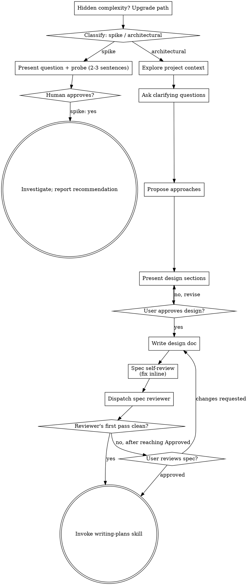

# Brainstorming Ideas Into Designs

Help turn ideas into fully formed designs and specs through natural collaborative dialogue.

Start by classifying how much process the request needs, then work
through your path: understand the context, refine the idea, present a
design, and get your human partner's approval.

<HARD-GATE>
Do NOT invoke any implementation skill, write any code, scaffold any
project, or take any implementation action until you have told your
human partner what you intend and they have approved it. This applies
to EVERY task on EVERY path below — the ceremony scales with the task;
the approval gate never does.
</HARD-GATE>

## Two Paths

Before your first question, classify the request and say the
classification out loud — "this looks like a spike, so I'll find out and
report back rather than build anything we keep" — so your human partner
can override it:

- **Spike** — a feasibility question ("can we...", "is it possible...",
  "quick and dirty is fine") whose output is an answer, not code you
  keep. Present the question and what you'll try in 2-3 sentences, get
  a nod, then find out as cheaply as correctness allows. No design
  doc, no spec file. Report findings as a recommendation; anything you
  built stays labeled throwaway.
- **Architectural** — new projects, new subsystems, changes that
  restructure how components fit together or alter interfaces others
  depend on. Follow the full process: questions, approaches, sectioned
  design, written spec, then the writing-plans skill.

When in doubt between two paths, take the heavier one. The ratchet is
one-way: hidden complexity discovered mid-task upgrades the path —
stop, say so, and step up. Nothing downgrades mid-task.

## Anti-Pattern: "Too Simple To Need Approval"

Every path ends with your human partner approving your intent before
implementation. A todo list, a single-function utility, a config
change — the artifact may be short, but you MUST produce it, present it,
and get approval. "Simple" tasks are where unexamined assumptions cause
the most wasted work. What scales with simplicity is the length of the
artifact, never its existence, and never the approval.

## Red Flags

| Thought | Reality |
|---------|---------|
| "This is too simple to need a design" | Simple means a shorter spec, not no spec. Write it, then get approval. |
| "The spike works, so I'll keep the code" | A spike's output is an answer. Keeping the code is a new request — classify it. |
| "It grew, but I'm almost done — no need to re-classify" | Hidden complexity upgrades the path mid-task. Stop and say so. |
| "They approved the spike, so the follow-up change is approved too" | Each task gets its own classification and its own approval. |
| "The topic is hard, but I can compress it into a chip" | Compressing a hard topic is exactly what makes it unreadable. Hard topics go in prose. |
| "I fixed every issue the reviewer raised, so the skip is back on" | An issue means a judgment call was needed and you made it. The skip is gone. |
| "They will know what this name means" | You have not agreed on it in this conversation. Say it in everyday words. |
| "One recommendation reads cleaner than three options" | One option leaves your partner nothing to catch it with when it is wrong. |
| "This requirement came from the PDF, so a summary is fine" | Your summary is your reading. Quote it. |

## Talking To Your Human Partner

Every message you send during brainstorming MUST be understandable to a
general engineer with portable skills who has NOT read this repository.
Requirements settled through words your partner could not follow are not
settled at all.

Assume your reader does not know this repo's variable names, type names,
function names, internal API names, or file names — nor any term that only
means something inside this codebase. General technical vocabulary (DB
terms, language names, OSS and framework names) is fine. Aim at the level
you would write for a PM.

**Four things that break understanding. Never do them:**

| # | Do not | Instead |
|---|--------|---------|
| A | Talk in unagreed identifiers — variable, type, function, API, or file names, or an English term you drifted into | Say what it is in everyday words. `Vendor.enabled_features` → "the per-vendor setting for which features are on". Once you have explained a term, you may keep using it |
| B | Put the conclusion after its premises | Lead with the conclusion, then the reason |
| C | Use phrasing that hides who does what — "we'll go with a checking approach" | Name the actor, the object, and the action: "I will read the git log one commit at a time and list any missed renames" |
| D | Refer back with "the earlier item" or "as discussed" | Restate it. Your partner cannot scroll back past a hook boundary |

When you ask a question, supply what your partner needs in order to
decide: your recommendation and why, the trade-offs, and the assumptions
it rests on. Rewording the question is not supplying material.

**Two ways to ask. Pick per topic, by whether your partner can decide
without a briefing:**

| | Simple topic | Hard topic |
|---|---|---|
| Test | They can decide without you explaining background first | The options only make sense after you explain background |
| How | `AskUserQuestion` | Prose in chat. **Do NOT use `AskUserQuestion`** |
| Shape | Usually two or three options, with the one you would pick named and why — "I would go with X, because …. Does that look right?" | As many options as you actually see, with the one you would pick named and why — "Roughly, the ways to do this are X, Y and Z. I would go with X, because …. Which looks right?" |

Hard topics never go through `AskUserQuestion` because it holds only as
much text as fits in a chip, and a hard topic squeezed into that space
stops being understandable. A partner who cannot follow the options clicks
through without reading them, and the answer you get decides nothing.

- Never offer a single option, on either kind of topic. One option leaves
  your partner nothing to catch it with when it is wrong.
- Do NOT pad to a fixed count either. Two or three usually covers a simple
  topic; on a hard topic, give as many as you actually see.
- Always name the one you would pick and say why. Naming a pick is not
  narrowing to it — the alternatives stay on the table.

**There is no separate phase for letting your partner talk.** Inviting
them to speak freely is one of the two ways to ask, not a step of its own.
Zero free-form asks across a whole session is fine: if your questions
settled everything, there is nothing left to invite them to talk about.

**The decision is always your human partner's.** Investigate whatever they
need in order to decide — that part is yours. Decide the things an
implementer would settle at their own discretion — that part is yours too.
What gets built is not. Choosing among the results of your own
investigation is a decision, so bring it to them rather than settling it.

**Draw pictures, and draw them often. Never ask permission first.** Prefer
showing the shape of a thing over describing it — where the pieces sit,
what flows where, which branch a decision takes. Use ASCII art:
brainstorming happens in a terminal, where a mermaid block stays a block of
code and never becomes a picture. ASCII art costs your partner nothing and
needs no consent, so draw it freely, as often as it helps. Inside the spec
file, keep using mermaid — that renders where the spec is read.

**The browser companion opens only when your partner asks for it.** Do NOT
offer it, and do NOT decide on their behalf that a question would be better
in a browser. Opening it takes their consent, and asking for that consent
costs a round trip that ASCII art does not. When they ask, read
[visual-companion.md](visual-companion.md) and use the browser for what
they asked to see; keep drawing ASCII art for everything else.

## Checklist

Classify first, announce the path, then create a task for each item on
your path and complete them in order.

**Spike:**
1. **Explore project context** — enough to frame the probe
2. **Present question + probe plan** — 2-3 sentences
3. **Get approval** — a nod is enough
4. **Investigate** — as cheaply as correctness allows
5. **Report findings** — a recommendation; label anything built as throwaway

**Architectural:**
1. **Explore project context** — check files, docs, recent commits
2. **Ask clarifying questions** — one at a time, understand purpose/constraints/success criteria
3. **Propose approaches** — as many as you actually see, never just one, with the one you would pick named and why
4. **Present design** — in sections scaled to their complexity, get user approval after each section
5. **Write design doc** — save to `docs/superpowers/specs/YYYY-MM-DD-<Japanese topic>-design.md` and commit
6. **Spec self-review** — quick inline check for placeholders, contradictions, ambiguity, scope, traceability (see below)
7. **Dispatch spec document reviewer** — one subagent, then record the verdict (see below)
8. **User reviews written spec** — SKIP this only if the reviewer's FIRST pass returned no issues; otherwise ask the user to review the spec file
9. **Transition to implementation** — invoke writing-plans skill to create implementation plan

## Process Flow



**Terminal states are path-bound.** Architectural: the ONLY skill you
invoke after brainstorming is writing-plans — never frontend-design,
mcp-builder, or any other implementation skill. Spike: the terminal
state is a reported recommendation.

## The Process

The subsections below serve the architectural path (a spike stops at
"present the probe, get a nod").

**Understanding the idea:**

- Check out the current project state first (files, docs, recent commits)
- Before asking detailed questions, assess scope: if the request describes multiple independent subsystems (e.g., "build a platform with chat, file storage, billing, and analytics"), flag this immediately. Don't spend questions refining details of a project that needs to be decomposed first.
- If the project is too large for a single spec, help the user decompose into sub-projects: what are the independent pieces, how do they relate, what order should they be built? Then brainstorm the first sub-project through the normal design flow. Each sub-project gets its own spec → plan → implementation cycle.
- For appropriately-scoped projects, ask questions one at a time to refine the idea
- Only one question per message - if a topic needs more exploration, break it into multiple questions
- Focus on understanding: purpose, constraints, success criteria
- **spec を書き始める前に必ず人間と合意すること:** 実装タスクの受け入れ条件と、成果物が満たすべきシステム上の性質（正しさの不変条件、性能の枠、安全性・セキュリティ性、互換性の保証など）は、spec の執筆を開始する前に必ず人間と認識をすり合わせること。これらは実装者の裁量で決めてよい事項ではない。どちらかでも不明瞭であれば、質問すること。

**Exploring approaches:**

- Present options conversationally with your recommendation and reasoning
- YAGNI ruthlessly - remove unnecessary features from every approach and design

**Presenting the design:**

- Once you believe you understand what you're building, present the design
- Scale each section to its complexity: a few sentences if straightforward, up to 200-300 words if nuanced
- Ask after each section whether it looks right so far
- Cover: architecture, components, data flow, error handling, testing
- Be ready to go back and clarify if something doesn't make sense

**Design for isolation and clarity:**

- Break the system into smaller units that each have one clear purpose, communicate through well-defined interfaces, and can be understood and tested independently
- For each unit, you should be able to answer: what does it do, how do you use it, and what does it depend on?
- Can someone understand what a unit does without reading its internals? Can you change the internals without breaking consumers? If not, the boundaries need work.
- Smaller, well-bounded units are also easier for you to work with - you reason better about code you can hold in context at once, and your edits are more reliable when files are focused. When a file grows large, that's often a signal that it's doing too much.

**Working in existing codebases:**

- Explore the current structure before proposing changes. Follow existing patterns.
- Where existing code has problems that affect the work (e.g., a file that's grown too large, unclear boundaries, tangled responsibilities), include targeted improvements as part of the design - the way a good developer improves code they're working in.
- Don't propose unrelated refactoring. Stay focused on what serves the current goal.

## After the Design (architectural path)

**Documentation:**

- Write the validated design (spec) to `docs/superpowers/specs/YYYY-MM-DD-<Japanese topic>-design.md`
  - (User preferences for spec location override this default)
- Use elements-of-style:writing-clearly-and-concisely skill if available
- Commit the design document to git
- Commit again after the self-review, after the reviewer's fixes, and after any
  change your partner asks for. The path you quote to them must name a
  committed file.

**Path and naming:**

- Name the file in Japanese, following
  `docs/superpowers/specs/YYYY-MM-DD-<Japanese topic>-design.md`.
- Inside the document, never write user-specific absolute paths. Use two
  placeholders:
  - `<work-root>` — the result of `git rev-parse --show-toplevel` at execution
    time. Use it for every edit target, command, and test path.
  - `<repo-root>` — the repo's main tree, the first `worktree` line of
    `git worktree list --porcelain`. Use it only when you must point at a
    different worktree or the main tree explicitly. Rare.
- When you tell the user where the spec lives, give the absolute path starting
  from `/`, not a relative path and not a `<work-root>/…` placeholder, so they
  can open it straight from an editor or terminal. This is deliberately the
  opposite of the in-document rule above.

**Required spec content:**

Two things are mandatory in every spec. Everything else about the document
is yours to shape.

1. A line under the title, stating that the file holds only what was
   agreed in conversation:

   **このファイルには会話で合意したことだけを書く。** 合意していない案は書かない。

2. A `## 決定事項` section carrying every decision settled with your human
   partner — one `<details>` block per decision, in the order they were
   settled. 日時, 決定者 and 証拠 are required; 決定を促した人 and
   関連リンク may be left as なし when there are none.

   <details>
   <summary>[[決定事項内容]]</summary>

   <p>日時: YYYY-MM-DD</p>
   <p>決定者: 氏名, 役職</p>
   <p>決定を促した人: 氏名, 役職 (ここはAIとなることもある)</p>
   <p>証拠: "decisionを原文引用（前後の会話を含む）"</p>
   <p>関連リンク: URL</p>

   </details>

   決定者 is whoever actually made the call. When your partner relays a
   decision someone else made — a PM, a lead — name that person as 決定者
   and record that it arrived through your partner. Quote the wording they
   decided in; never paraphrase it.

**Everything an implementer needs goes in the spec itself.** A spec that
sends its reader to another document to find a requirement is incomplete.
When your partner hands you material — a PDF, a spreadsheet, a page of
notes — quote the parts the implementation depends on verbatim into the
spec, and record where each came from: path, filename, page. Do not
summarize a requirement you are about to build from. A summary is your
reading of the material, and your reading is the part that breaks.

**Spec Self-Review:**
After writing the spec document, look at it with fresh eyes:

1. **Placeholder scan:** Any "TBD", "TODO", incomplete sections, or vague requirements? Fix them.
2. **Internal consistency:** Do any sections contradict each other? Does the architecture match the feature descriptions?
3. **Scope check:** Is this focused enough for a single implementation plan, or does it need decomposition?
4. **Ambiguity check:** Could any requirement be interpreted two different ways? If so, pick one and make it explicit.
5. **Traceability check:** Can every requirement be traced back to something the user actually said in this conversation? Delete the ones that cannot. Never add a requirement because it "seems useful" — ask instead. Implementation details you would decide at your own discretion do not belong in the spec at all.

Fix any issues inline.

**Spec Document Review:**
After the inline self-review, dispatch one spec document reviewer using
[spec-document-reviewer-prompt.md](spec-document-reviewer-prompt.md).

The reviewer is background work — the rule that follows about not
babysitting it applies. Reflect the result and write the record when it
returns.

The session gate reads that record; without it you cannot end your turn.
Record the reviewer's verdict alongside the five self-review checks, in the
single `review-record.mjs` call below. Pass `approved` only when the
reviewer approved; anything else leaves the gate shut — which is also why
you cannot end your turn on a spec whose reviewer has not approved. Keep
fixing and re-dispatching until it does. There is no attempt limit.

Some issues are not yours to fix. A requirement the reviewer cannot trace to
a decision, or a `証拠` you cannot fill from what your partner actually said,
is resolved by asking them — never by inventing an entry or a quote. When you
must ask, dispatch the fresh review first, so background work is in flight
when your turn ends and the gate defers its check. A reviewer that returns no
`Spec Review` block has not approved: dispatch again, and never record a
verdict you did not read.

Record the FIRST pass's issues too — one `--reviewer-issue "<issue>"` for each
issue that first review raised, or none if it was clean. The skip rule below
turns on that first pass, and the record is the only place that fact survives
a compaction.

**Do not babysit background work.** If you dispatched a subagent or started a
background task at any point, end your turn instead of emitting filler text
while you wait — the Stop gate defers its check while background work is in
flight, and you are re-invoked automatically when the work completes.

```bash
node "${CLAUDE_PLUGIN_ROOT}/lib/review-record.mjs" write <spec-path> \
  --skill brainstorming \
  --check "Placeholder scan=<what you found>" \
  --check "Internal consistency=<what you found>" \
  --check "Scope check=<what you found>" \
  --check "Ambiguity check=<what you found>" \
  --check "Traceability check=<what you found>" \
  --reviewer-status approved
```

Write one `--check` per item above — all five are required. If you edit the spec
after recording, run the command again: the record is bound to the file's
contents and goes stale on any edit. Run this command once the reviewer has
approved, not before.

`<spec-path>` MUST be the absolute path you passed to Write, verbatim. The
record is stored beside its target and the gate verifies exactly the paths this
session wrote. In a worktree that is the worktree's path — re-deriving the path
from the main tree records against a file the gate never checks, and the gate
stays shut while the record looks written.

**User Review Gate:**
Whether your human partner must review the spec depends on what the
reviewer returned on its FIRST pass.

Count only the reviewer's `Issues`. Its `Recommendations (advisory, do not
block approval)` are not issues — treat a pass carrying only
recommendations as a pass with no issues. Counting them would mean one
advisory line kills the skip, and the rule would never fire.

- **First pass returned Approved with no issues.** Nothing in the spec was
  unclear, unsupported or contradictory, so there is nothing left to ask.
  Go straight to writing-plans. Tell your partner the spec is written, give
  the absolute path, and say you are moving on.
- **First pass returned any issue.** Fix the issues and dispatch a fresh
  review, as many rounds as it takes to reach Approved — then STOP and ask
  your partner to review the spec. An issue means that part of the spec
  needed a judgment call, and the call you made is yours, not theirs. A
  later clean pass does not buy the skip back.

> "Spec written and committed to `<path>`. Please review it and let me know
> if you want to make any changes before we start writing out the
> implementation plan."

Wait for their response. If they request changes, make them, re-run the
inline self-review and a fresh reviewer dispatch, and record the result.
Only proceed once they approve.

**Implementation:**

- Invoke the writing-plans skill to create a detailed implementation plan
- Do NOT invoke any other skill. writing-plans is the next step.

## Visual Companion

A browser-based companion for showing mockups, layouts and visual designs
during brainstorming. It opens ONLY when your human partner asks for it.
Do not offer it, and do not decide on their behalf that something would be
better seen in a browser — draw ASCII art in the terminal instead, which
needs no consent. See **Talking To Your Human Partner** above.

When they ask for it, start the server with `--open` so their browser opens
to the first screen automatically, and read the detailed guide before
proceeding:
`skills/brainstorming/visual-companion.md`

Use the browser for what they asked to see. Keep drawing ASCII art for
everything else.
