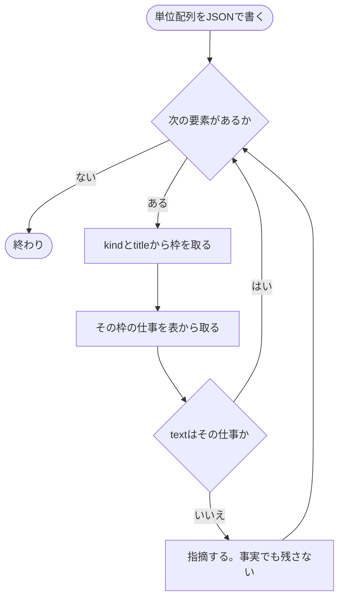
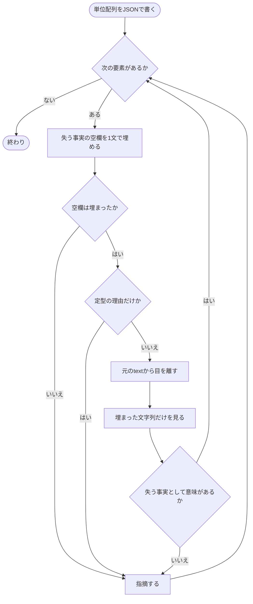

# Phase 5 — セルフレビュー

**軽量モードでも本気モードでも、親のセルフレビューは必ず通す。** 本気モードではそれに加えてサブエージェントにもレビューさせる。

検査の軸は 2 種類に分かれる。**全周回まわる軸**は表層検出とセルフレビュー 14 問。**前半だけの軸**は語り口と圧縮で、本気モードは 1〜2 周目、軽量モードは 1 周目だけ動く。

本気モードの 1〜2 周目は、レビュー役・語り口の判定役・圧縮担当の 3 体を同じ 1 レスポンスで並列に起動する。3 周目以降はレビュー役 1 体だけ。**軽量モードのエージェント数は 0 のまま**で、語り口と圧縮は親が 1 周目に見る。

## 問い

1. この文をなぜ書いたのか、1 文ずつ答えられるか
2. 人間が読む理由がない文が残っていないか
3. 本文だけを読んだ人が、この PR で何をしたのかを言えるか
4. 順序を入れ替えた方が読みやすい箇所はないか。番号コメントは番号順に読み、後ろの番号を先に読まないと分からない箇所がないかを見る
5. 本文と行コメントが差分と食い違っていないか
6. 一覧に上がった語のうち、初出に説明が付いていないものはないか
7. テストを書いたなら、1 段階目に `テストしたこと` と `テストしてないこと` があるか
8. 文書だけの変更なのにテストを書いてしまっていないか
9. 3 段階目が 2 段階目の補強になっているか
10. ドキュメントに、読者が辿るべきリンクの取りこぼしが無いか
11. 変更のサマリーが概要の言い直しになっていないか
12. 任意枠のタイトルが、中身を見ずに分類名から選ばれていないか
13. これから誰かが何かをする話と、書き手の評価や提案が書かれていないか。話の例は予定・確認の段取り・引き継ぎ、評価や提案の例は `〜すべき` `〜した方がよい` である
14. 一覧に上がった丸括弧のうち、補足を押し込んでいるものはないか

1 と 2 は別物。枠の仕事でも、読み手が失う事実が無い文はある。逆もある。

問い 4 の番号コメントは、1 番から順に番号コメントだけを読んで確かめる。後ろの番号で初めて出てくる事柄を前提にしている番号コメントがあれば、番号を振り直す指摘として出す。直すときは `WORKDIR/reading-order.json` の `chosen` と `reason` も振り直した後の順に合わせる。

問い 5 は差分と突き合わせる。**直していない箇所を直したと書いていないか、書いていないテストを書いたと書いていないか。** これは読みやすさの問題ではなく嘘の問題で、レビュワーを最も強く誤誘導する。

## 検証手順

対象は、このスキルが PR に書く説明文の全部とコメントの全部。`<!-- pr-desc: ... -->` は対象外。

問い 1 と 2 の前に、単位の配列を JSON で `WORKDIR/ledger/<実行 ID>/units-iter-<N>.json` に Write する。句点では切らない。別エージェントは立てない。枠の仕事かどうかは JSON に書かない。

番号コメントは `line-comments.json` の 1 件を 1 要素として足す。切らない。切るのは本文と、改行のある意図コメント。単位は枠の中の主張 1 つ。箇条書きなら 2 段階目 1 項目である。

```json
[
  {"kind": "open", "title": "", "text": "50点埋めをやめた。"},
  {"kind": "details", "title": "テスト", "text": "リトライ上限で止まること"},
  {"kind": "numbered", "title": "", "text": "採点できなかった候補に仮の点をつける経路"},
  {"kind": "intent", "title": "", "text": "穴埋めを消していないのは他スキルが通っているため。"}
]
```

- `kind` は置き場。`open` / `details` / `numbered` / `intent`
- `title` は `<summary>`。展開とコメントは空文字
- `text` が 1 件の単位

`kind` と `title` から枠を取る。`open` は展開部分。`details` で title が予約タイトルならその枠。`details` でそれ以外なら任意枠。`numbered` は番号コメント。`intent` は意図コメント。

### 問い 1

その text は、今いる枠の仕事か。違うなら指摘。情報として正しくても残さない。



枠の仕事:

- 展開部分 — 主眼。何をしたか
- 変更のサマリー — 何を変えたかの事実。なぜ・経緯は置かない
- ドキュメント — 読者が辿るリンク
- テスト — `テストしたこと` / `テストしてないこと`。やっていない事実だけ
- 任意枠 — そのタイトルが指す中身
- 番号コメント — 読む順序と、そのコードが何をやっているか。実装意図は置かない
- 意図コメント — 普通ならこう書くところを敢えて外している理由。ついで変更

### 問い 2

各 text について、「この文が無いと読み手が失う事実: ＿＿」を 1 文で埋める。埋まれば通過、にはしない。空欄に入る事実の種類は例で縛らない。図の「定型の理由」は「流れのため」「揃えるため」「丁寧にするため」。



## 問い 6 の見方

Phase 4 が保存した `slop-iter-<N>.json` の `identifiers` を Read する。**記憶で語を探さない。** 一覧を 1 行ずつ潰す。自分が書いた語は自分には馴染んでいるので、自分では引っかからない。一覧という外部の事実を使う。

各語について判定する。

| 判定 | 扱い |
|---|---|
| このリポジトリの中でしか通じない語で、初出に説明がない | 指摘。言い換えるか、初出に説明を足す |
| このリポジトリの外でも通じる語。DB 用語・言語名・OSS 名がこれに当たる | 対象外 |
| 初出に既に説明が付いている | 対象外 |

**一覧に載らない語も自分で探す。** 機械は語の形で拾うので、次の 3 種類は一覧に入らない。

- `Vendor` のような大文字始まりの英単語 1 語。`PR` `AI` `DB` `GitHub` と形が同じで、機械には区別できない
- `pr-review` `rules-distill` のようなハイフン区切りの名前。スキル名やパッケージ名がこれに当たる
- リポジトリ固有の日本語の造語

このリポジトリの中でしか通じないなら、一覧に無くても指摘する。

`identifiers` が空でも問い 6 は飛ばさない。機械が取れない上の 3 種類が残っている可能性があるため。

## 問い 13 の見方

問い 13 は差分を見ても分からない。文の形で分かるものは Phase 4 の `禁止表現` が語で見ているので、ここでは機械が拾えない言い回しを拾う。たとえば「あとで担当者が実機を見る」である。予定や評価が出たら、その文を消す。事実を足して言い換えない。

## 問い 14 の見方

Phase 4 が保存した `slop-iter-<N>.json` の `parens` を Read する。**記憶で丸括弧を
探さない。** 一覧を 1 行ずつ潰す。自分が書いた丸括弧は自分には自然に見えるので、
一覧という外部の事実を使う。

各件について判定する。

| 判定 | 扱い |
|---|---|
| 論理名から物理名への短い言い換えになっている | 残してよい |
| それ以外 | 指摘。丸括弧を消し、中身を独立した文として書き直す。中身を出す必要が無ければ丸括弧ごと消す |

判定に迷ったら、丸括弧を消して文を分ける。基本は物理名を書かない方が短くて読みやすい。

**`parens` が空なら問い 14 はそこで終わりにしてよい。** 丸括弧は形だけで拾え、一覧は
機械が作るので自分で探し直す必要は無い。ただし行をまたぐ丸括弧は機械にも拾えない。
問い 6 のように「空でも飛ばさない」とはしない。

## 本気モードの追加レビュー

`<WORKDIR>/level.txt` を Read し、`MODE` が `serious` のとき、Agent ツールで `agentType: "pr-description-reviewer"` を **1 体だけ**起動する。**記憶で判断しない。** 問いは上と同じ。

本気モードの 1〜2 周目は、この起動と**同じ 1 レスポンス**で語り口の判定役と圧縮担当も並列に起動する。詳細は下記の 2 節にある。3 体を待ってから Phase 6 に進む。

**問いを変えないこと。** 価値は問いの違いではなく、読む人が書いた本人でないことにある。

dispatch プロンプトには本文・行コメント・差分・`slop-iter-<N>.json` の 4 つのパスを渡す。それ以外は渡さない。定義を親側からインラインで貼り付けない。

本気モードのレビュー担当は Grep を使えるので、問い 6 で「この語はこのリポジトリの造語か、外でも通じる語か」をリポジトリ検索で実際に確かめられる。軽量モードの親は検索せず手持ちの知識で切る。取りこぼしは増えるが、軽量モードは数分で終わらせるものなのでそこは割り切る。

**エージェントが無い環境ではこの追加レビューをスキップし、スキップしたことを報告する。** 黙って飛ばさない。親のセルフレビューは上の問いのことで、環境に関係なく必ず通すので、スキップしてよいのはエージェント側だけ。

## 語り口の判定

`<WORKDIR>/level.txt` が `serious` で、**かつ今が 1 周目か 2 周目のとき**に実行する。何周目かは台帳ディレクトリの `iter-<N>.json` の個数で判定する。0 個なら 1 周目、1 個なら 2 周目である。**記憶で判断しない。**

`light` のときは、**1 周目だけ親が自分で判定する。** 判定の中身は同じで、見るのは語り口だけ。**軽量モードでもエージェントは立てない。**

**判定は二択だけ。点数・閾値・順位・深刻度を持ち込まない。**

上のレビュー役と**同じ 1 レスポンス**で並列に起動する。順番に待たない。

### 判定対象を作る

次の枠を集めて JSON にし、`<WORKDIR>/ledger/<実行 ID>/frames-iter-<N>.json` に Write する。`kind` は `open` `details` `numbered` `intent` `title` の 5 種類で、`概要` は `title` が `概要` の `details` として区別する。

| `kind` | 中身 | `job`。枠の仕事 |
|---|---|---|
| `open` | 展開部分の全文 | 主眼。何をしたか |
| `details` で `title` が `概要` | `概要` の `<details>` の中身。主眼が 3 つ以上で畳んだときだけ存在する | 主眼。何をしたか |
| `details` | 任意枠 1 つ。予約タイトル以外の `<details>` である。`title` に summary を入れる | そのタイトルが指す中身 |
| `numbered` | 番号コメント 1 件 | 読む順序と、そのコードが何をやっているか |
| `intent` | 意図コメント 1 件 | 普通ならこう書くところを敢えて外している理由 |
| `title` | PR タイトル。`create` モードのときだけ | 主眼の文に過去 PR の型を被せた 1 行 |

**予約タイトルのうち `変更のサマリー` `テスト` `ドキュメント` の 3 つは入れない。** 1 段階目のバイト制限や固定見出しで構造が決まっていて語り口の余地が無いため。

**`概要` は判定対象に加える。** 主眼が 3 つ以上で畳んだとき、展開部分の代わりに主眼の散文が入るのはここだけになる。詳細は `references/phase-3.md` の `<details>` の節にある「概要」を参照。`概要` は 750 バイト上限の対象外で固定見出しも無く、自由な散文が入るので、他の 4 つとは事情が違う。上限の値は `lib/slop-check.mjs` の `detailsの中身の最大バイト数` を見よ。畳んでいないときは、展開部分が本文にあるので `概要` の枠自体が無い。判定対象は `open` だけになる。

各要素は `{"kind": ..., "title": ..., "text": ..., "job": ...}`。

**この枠の配列は圧縮担当も読む。** 対象が一致しているので 2 つ作らない。軽量モードでも 1 周目に作る。親が語り口と圧縮を見るためである。

### 起動する

Agent ツールで `agentType: "pr-description-tone-judge"` を **1 体だけ**起動する。dispatch プロンプトには 4 つのパスだけ渡す。

- 判定対象の JSON のパス。`frames-iter-<N>.json`
- 差分のパス
- 結果を Write するパス。`<WORKDIR>/ledger/<実行 ID>/tone-iter-<N>.json`
- 文章規範のパス。`references/ai-writing.md`

規範は 1 ファイルなので、パスだけを渡すと全文を読む。**読ませる節を名指しすること。**

- **読ませる節。** `### 演出の抑制` `### LLM っぽい表現の禁止` `### 冗長の排除` `### 大げさに言う` `### 言い方の癖` の 5 つだけ
- **読ませない節。** `## この規範の使い方` `## 論証` `## 読み手` `## 見た目` `## 語彙` の 5 節すべて。`## 論証` `## 読み手` `## 見た目` `## 語彙` は主張の正しさ・文章の構造・語の選択の話で、`## この規範の使い方` はこの規範の使い方の説明であり、どれも語り口の二択判定の仕事ではない

定義を親側からインラインで貼り付けない。

### 足切りする

判定役が書いた JSON をスクリプトに通す。**目視で引用を確かめない。**

```bash
node <SKILL_DIR>/lib/filter-tone.mjs \
  --findings-file <WORKDIR>/ledger/<実行 ID>/tone-iter-<N>.json \
  --input-file <WORKDIR>/ledger/<実行 ID>/frames-iter-<N>.json \
  > <WORKDIR>/ledger/<実行 ID>/tone-kept-iter-<N>.json
```

`--input-file` には判定役に渡したのと**同じ**枠の配列を渡す。渡すのは `frames-iter-<N>.json` である。引用の実在は、指摘が名指しする `kind` と `title` の組を**共有するすべての枠**の `text` を合わせて見て確かめる。番号コメント・意図コメントはどちらも `title` が空なので、同じ種類の枠が複数あるときはこの組を共有する。番号コメント #1 と #2 がその例である。そのため種類の中での取り違えは通る。引用の帰属先を番号コメント #2 と #1 で間違える場合などである。捨てるのは、組そのものが異なる枠にだけ出現する引用である。たとえば展開部分の引用が番号コメントの中にしか無い場合である。これは「引用が本文に無い」として捨てる。指摘が名指しする `kind` と `title` の組が入力に無い指摘も同様に捨てる。`create` モードのタイトルは `frames-iter-<N>.json` に既に `kind: "title"` の枠として入っているので、別のファイルを渡す必要はない。

出力の `kept` が Phase 6 で直す対象。`dropped` は捨てた指摘とその理由で、台帳に載せる。

**`kept` が 0 件でも構わない。** AI が書いているので毎回指摘が出るとは限らない。0 件のまま Phase 6 に進む。

### 落ちたとき

スクリプトがエラーで止まるときは、**判定役を 1 回だけ再起動する。** ここでいうエラーは、出力が無いか形が壊れている場合を指す。それでも駄目なら語り口の判定をスキップし、**スキップしたことを報告する。黙って飛ばさない。**

**中間の値で埋めない。** 判定できなかった枠を「AI っぽい」とも「っぽくない」とも書かない。スキップはスキップとして残す。

### 軽量モードでも引用の門を通す

親が自分で判定した場合も、結果を判定役と同じ形のファイルに Write し、**引用の門を必ず通す。**

判定結果 1 件の形は次のとおり。**枠 1 つに対して 1 件書く。枠を飛ばさない。**

- `kind` / `title` / `verdict` / `quote` / `reason` の 5 項目
- `verdict` は `AIっぽい` か `っぽくない` の 2 つだけ。**「AI」と「っぽい」の間に空白を入れない。** 門が完全一致で見るためである。`"AI っぽい"` と書くと全件が門で落ちる
- `quote` はその枠の `text` に実在する文字列。`AIっぽい` のときだけ埋める

```json
{
  "findings": [
    {"kind": "open", "title": "", "verdict": "AIっぽい", "quote": "大幅に改善されました", "reason": "誇張した形容で中身が無い"},
    {"kind": "details", "title": "移行の順序", "verdict": "っぽくない", "quote": "", "reason": ""}
  ]
}
```

```bash
node <SKILL_DIR>/lib/filter-tone.mjs \
  --findings-file <WORKDIR>/ledger/<実行 ID>/tone-iter-<N>.json \
  --input-file <WORKDIR>/ledger/<実行 ID>/frames-iter-<N>.json \
  > <WORKDIR>/ledger/<実行 ID>/tone-kept-iter-<N>.json
```

**門を省かない。** 語り口の指摘は理由付きで残すことを認めない決着である。全件直す。本文に実在しない引用を親が自分で作ると、それがそのまま全件修正の対象になって本文が壊れる。

## 圧縮

**人間が読む文章は、トークンを使ってでも短くする価値がある。** 表層検出の上限は文の数を縛るだけで、1 文の中の冗長さは残る。セルフレビュー 14 問は単位を丸ごと消すかどうかを見ていて、残すと決めた文の中は見ていない。**そこを見るのがこの軸。**

対象は展開部分の文、`<details>` の中身、行コメントの全部。つまり枠の配列と同じ範囲。

### 親のチェック

`<SKILL_DIR>/policy/compress.md` を Read し、その方針に従って枠の中の冗長さを見つけ、縮める。**方針を読まずに圧縮しない。** 何を残すかが方針側に書いてある。

走らせる周回は軽量モードで 1 周目だけ、本気モードで 1〜2 周目。**3 周目以降は親も圧縮を見ない。** 見ると、そこで出た指摘の反映を検査するために 5 周目が必要になり、周回上限を変えられなくなる。

親のチェックには門を通さない。自分で見つけた箇所なので、引用が実在するかを機械で確かめる意味が無い。縮めるか、理由を書いて残すかのどちらかを台帳に書く。決着は Phase 6 である。方針の「変えてはいけないもの」は守る。台帳の `compress` に何を書くかは `references/phase-6.md` の台帳のキーの表を参照。

### 圧縮担当の起動

`<WORKDIR>/level.txt` が `serious` で、**かつ今が 1 周目か 2 周目のとき**、Agent ツールで `agentType: "pr-description-compressor"` を **1 体だけ**起動する。**記憶で判断しない。**

レビュー役と語り口の判定役と**同じ 1 レスポンス**で並列に起動する。順番に待たない。

2 周目は、起動の前に触ってはいけない引用の一覧を作る。

```bash
node <SKILL_DIR>/lib/filter-compress.mjs \
  --extract-quotes <WORKDIR>/ledger/<実行 ID>/compress-kept-iter-1.json \
  > <WORKDIR>/ledger/<実行 ID>/compress-notouch-iter-2.json
```

**親が台帳を目で読んで書き写さない。** 抜き出しはこのスクリプトがやる。

**触るな一覧の作成に失敗したら、`--no-touch-file` を渡さずに起動し、失敗したことを報告する。** 黙って飛ばさない。門 3 は効かないが、門 1 と門 2 は効く。

dispatch プロンプトには次のパスを渡す。それ以外は渡さない。定義を親側からインラインで貼り付けない。

- 枠の配列。`frames-iter-<N>.json` を指し、キーは `frames_path` である
- 差分。キーは `diff_path` である
- 圧縮方針。`policy/compress.md` を指し、キーは `policy_path` である
- 出力先。`compress-iter-<N>.json` を指し、キーは `output_path` である
- 触ってはいけない引用の一覧。`compress-notouch-iter-2.json` を指し、キーは `no_touch_path` である。2 周目だけ渡す

**台帳をそのまま渡さない。** 台帳には表層違反の決着・14 問の指摘と理由・語り口の書き直しが全部入っており、渡すと他の軸の判断に引きずられる。親が書いた keep の理由文を読めると、書いた本人でない目である価値も落ちる。

**エージェントが無い環境ではこの起動をスキップし、スキップしたことを報告する。** 黙って飛ばさない。親のチェックは環境に関係なく必ず通すので、スキップしてよいのはエージェント側だけ。

### 門を通す

圧縮担当の出力は、親が読む前にスクリプトでふるう。

```bash
# 1 周目
node <SKILL_DIR>/lib/filter-compress.mjs \
  --findings-file <WORKDIR>/ledger/<実行 ID>/compress-iter-1.json \
  --input-file <WORKDIR>/ledger/<実行 ID>/frames-iter-1.json \
  > <WORKDIR>/ledger/<実行 ID>/compress-kept-iter-1.json

# 2 周目
node <SKILL_DIR>/lib/filter-compress.mjs \
  --findings-file <WORKDIR>/ledger/<実行 ID>/compress-iter-2.json \
  --input-file <WORKDIR>/ledger/<実行 ID>/frames-iter-2.json \
  --no-touch-file <WORKDIR>/ledger/<実行 ID>/compress-notouch-iter-2.json \
  > <WORKDIR>/ledger/<実行 ID>/compress-kept-iter-2.json
```

門は 3 つある。

| 門 | 捨てるもの |
|---|---|
| 1 | 引用が無い / 名指しした枠が入力に無い / 引用がその枠の中に実在しない |
| 2 | 縮めた案が元の引用より短くない |
| 3 | 前周回に門を通った引用への再提案 |

**門 3 がラチェットの歯止め。** 1 周目に理由付きで残した引用へ 2 周目に再提案が来ても捨てる。文が書き換わればそれは別の引用になるので、新しい提案は通る。

`kept` は残った指摘のことで、Phase 6 で直す対象である。`dropped` は台帳に記録として残すだけで直さない。**`counts` の門ごとの件数を台帳に写す。**

### 目視でやらないこと

- **引用が本文にあるかを目で確かめない。** 門 1 がやる
- **縮んでいるかを目で数えない。** 門 2 がやる
- **前周回に出た引用かを台帳から探さない。** 門 3 がやる

## 出力

指摘を `WORKDIR/review-findings.json` に配列で書き出す。各指摘は該当箇所・どの問いか・どう直すかを含める。

```json
[{"where": "展開部分 1 文目", "question": 3, "fix": "何をしたのかが復元できない。主眼を言い直す"}]
```

指摘が無ければ空配列。
